# 2018-09-04选品清单

## 1.baby hangers
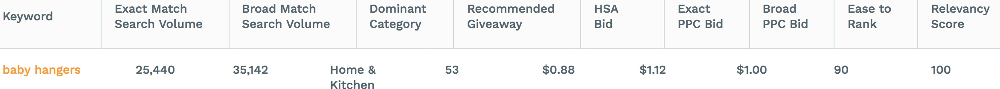
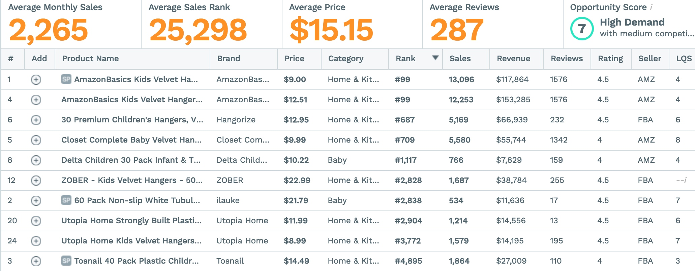

TOP10Rank分析：

- 销量集中在头部，有4个listing的sales大于5000
- Review数低于100个的只有2家
- 平均销量很高，第10名的销量也有500多
- 竞价费用低，推广难度低

*CRITICAL REVIEW*
- 质量差
- 铁环太小挂不上杆子
- 铁环转不了Not a swivel
- 铁环与衣架身的连接处经常断
- 铁环生锈
- 衣架本身太大不适合baby

## 2.Plastic Tablecloth
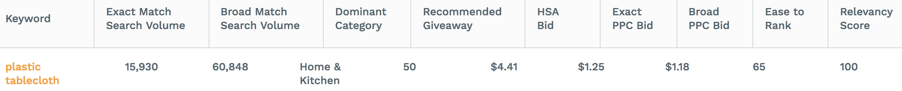
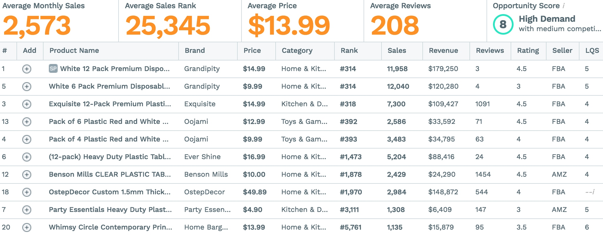

TOP10Rank分析：

- 销量集中在前3家，但其余销量平均
- 6家review低于100个
- 平均月销量很高，前10销量至少1000多
- 推广成本高，难度高（65分）

## 3.clear contact paper
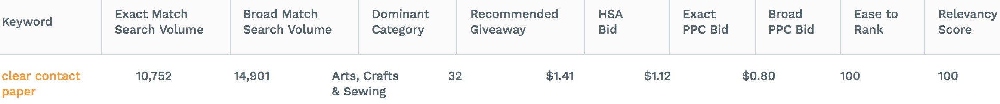
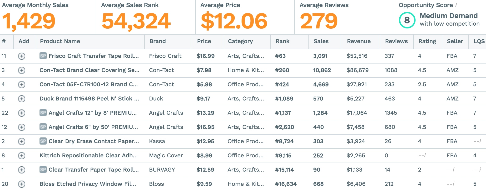

TOP10Rank分析：

- 销量集中在前3家，但其余销量平均
- 9家review低于100个
- 平均月销量较低，前10销量至少5800多,出去头部1家也有3000
- 推广成本低，难度低(＞90)

## 4.sandwich cutters for kids

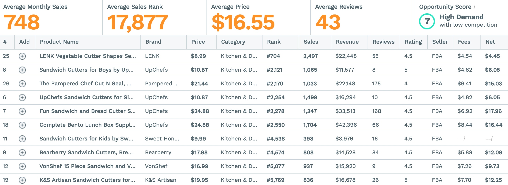

TOP10Rank分析：

- 销量很平均，前10平均月销量1200
- 8家review低于100，2家100多
- 推广成本低，难度低(＞80)

## 5.photo booth props
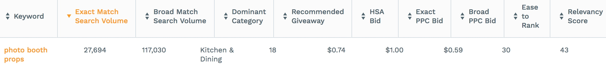
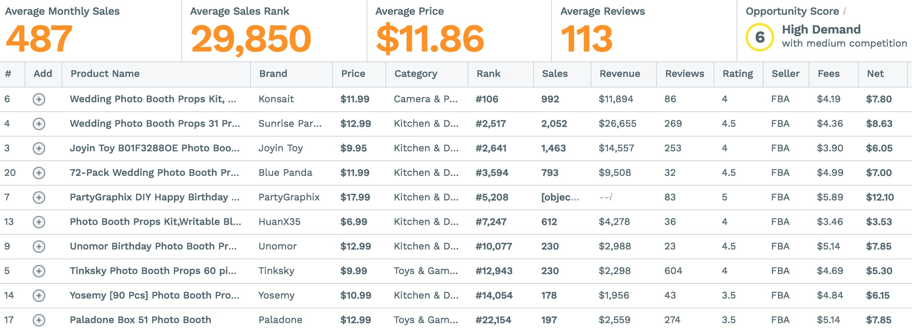
TOP10Rank分析：

- 销量集中在头部,总销量偏低
- 单价低，但利润率高
- 7家review低于100，3家200以上
- 推广成本较低，难度高(30)

## 6.paper bags
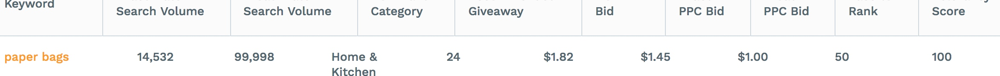
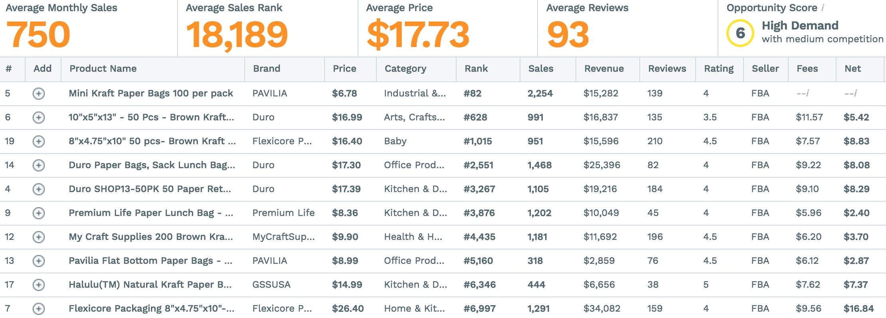

TOP10Rank分析：

- 销量相对集中
- 细分品类尺寸多，销量分化两极
- 4家review低于100
- 推广成本较高，难度比较高(50)

## 7.lunch paper bags
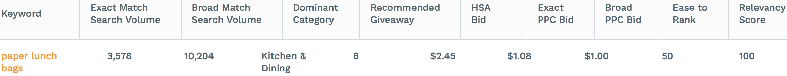
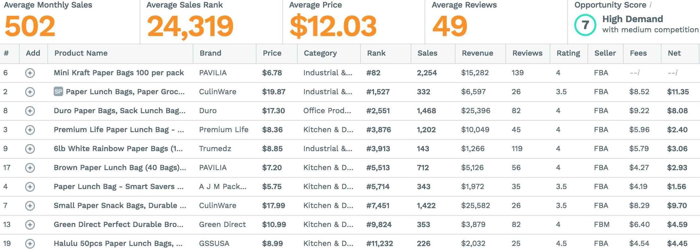

TOP10Rank分析：

- 销量还行，但单价低
- 前10的销量两极化
- 8家review低于100
- 推广成本较高，难度比较高(50)
- 产品的Listing质量普遍较低

## 8.Hanger Clips
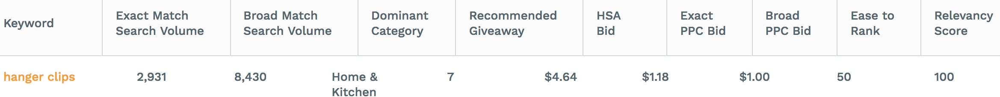
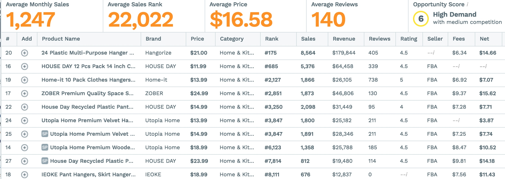

TOP10Rank分析：

- 销量较高，产品价格合适（＞$15）
- 销量集中在头部2家（＞5000），其余销量比较平均
- review多数大于100，但低于500
- 推广成本较高，难度比较高(50)

## 9.coffee cups
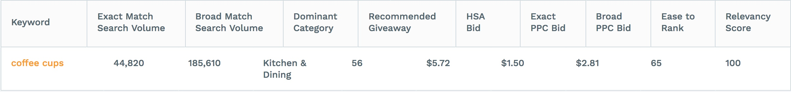
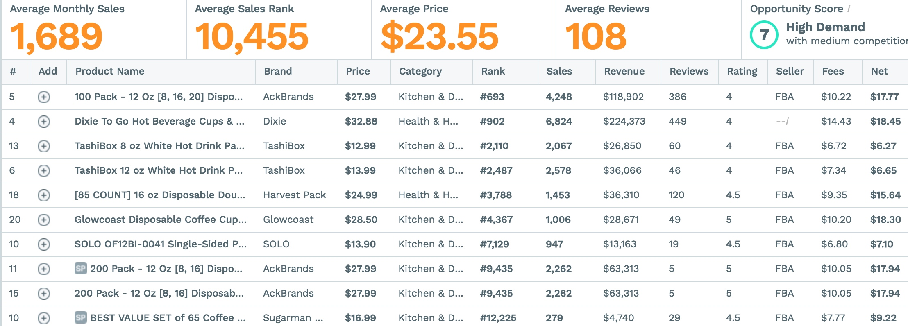

TOP10Rank分析：

- 销量高，单价高
- 销量头部2家略高，总体较为平均
- 7家review＜100
- 推广成本很高，难度中等(65)

## 10.Preserving Jars

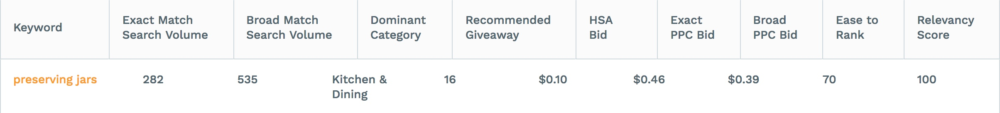
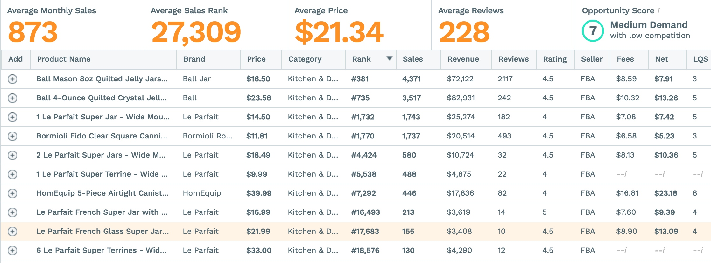

TOP10Rank分析：

- 销量高，单价高，利润率高
- 销量头部1家极高
- 除第1家外其余review数不算太高
- 推广成本很高，难度中等(65)

## 11.cupcake topper

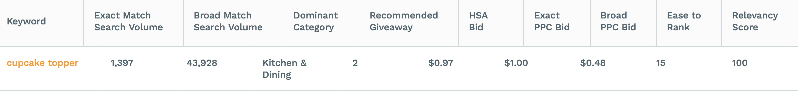
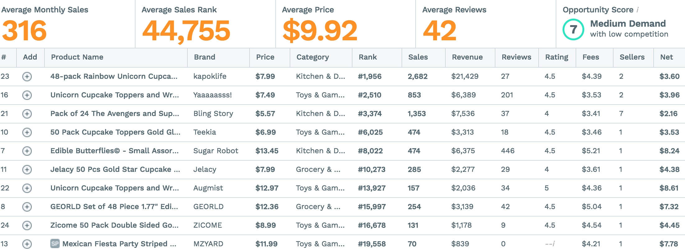

TOP10Rank分析：

- 销量较低，单价低
- 销量头部2家高，其他较平均
- 8家review＜100
- 推广成本较低，难度高(15)

## 12.wedding cake topper
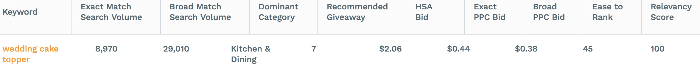
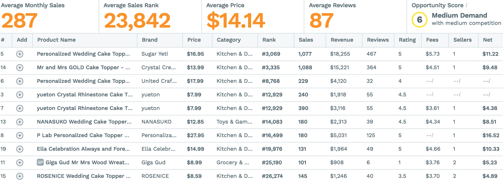

TOP10Rank分析：

- 销量低，利润率很高
- 销量头部2家较高，其他均匀
- 8家review数＜100个
- 推广成本高，难度较高(45)

## 13.gold cake topper
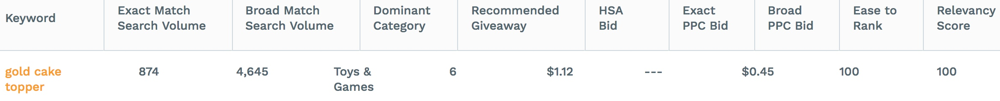
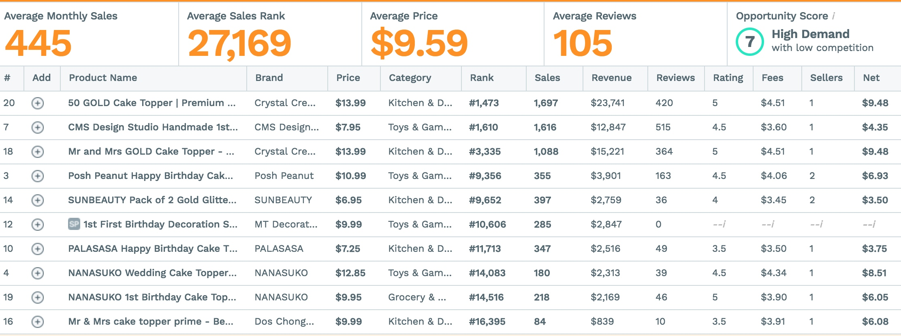

TOP10Rank分析：

- 销量一般，利润率很高
- 销量头部3家较高
- 6家review数＜100个
- 推广成本一般，难度很低

## 14.gold ballons
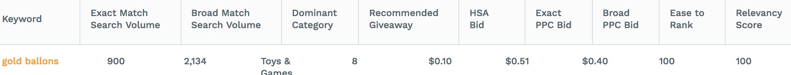
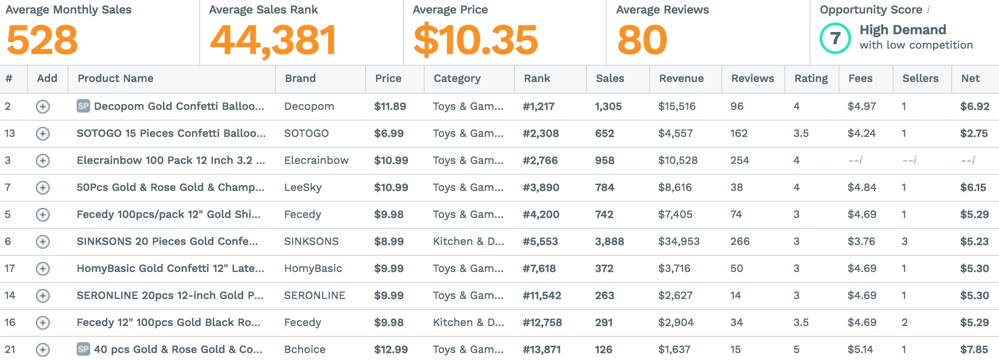

TOP10Rank分析：

- 销量还行，利润率很高
- 销量集中头部1家（不确定），但其他家均匀
- 7家review数＜100个
- 推广成本很低，难度很低（100）

## 15.Plastic Champagne Flutes
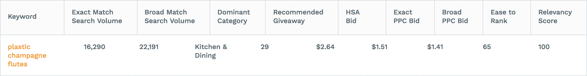
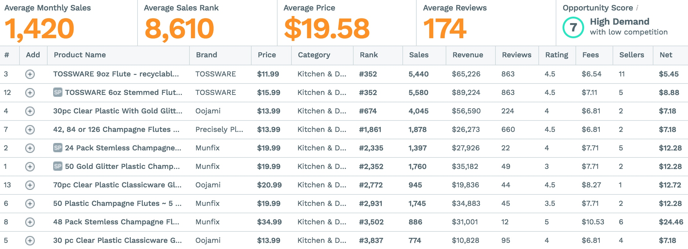

TOP10Rank分析：

- 销量很高，利润率还行
- 销量集中在头部2家（5000左右），其他1000左右
- 6家review数＜100个
- 推广成本高，难度高（65）

## 16.gold plastic cups
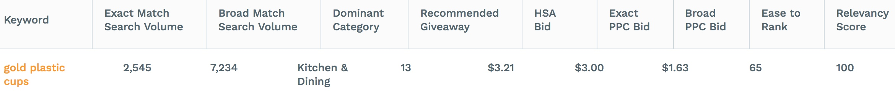
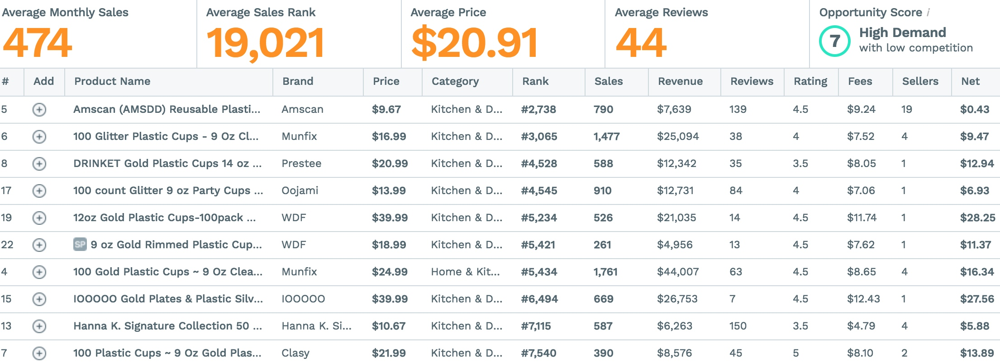

TOP10Rank分析：

- 销量一般，利润率高
- 销量比较均匀
- 8家review数＜100个
- 推广成本高，难度高（65）

