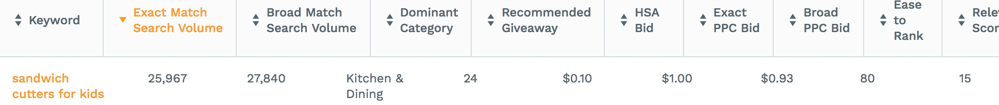

# 2018-09-04选品清单

1.baby hangers

TOP10Rank分析：
- 销量集中在头部，有4个listing的sales大于5000
- Review数低于100个的只有2家
- 平均销量很高，第10名的销量也有500多
- 竞价费用低，推广难度低

2.Plastic Tablecloth

TOP10Rank分析：
- 销量集中在前3家，但其余销量平均
- 6家review低于100个
- 平均月销量很高，前10销量至少1000多
- 推广成本高，难度高（65分）

3.clear contact paper

TOP10Rank分析：
- 销量集中在前3家，但其余销量平均
- 9家review低于100个
- 平均月销量较低，前10销量至少5800多,出去头部1家也有3000
- 推广成本低，难度低(＞90)

4.sandwich cutters for kids

TOP10Rank分析：
- 销量很平均，前10平均月销量1200
- 8家review低于100，2家100多
- 推广成本低，难度低(＞80)

5.photo booth props

TOP10Rank分析：
- 销量集中在头部,总销量偏低
- 单价低，但利润率高
- 7家review低于100，3家200以上
- 推广成本较低，难度高(30)

6.paper bags

TOP10Rank分析：
- 销量相对集中
- 细分品类尺寸多，销量分化两极
- 4家review低于100
- 推广成本较高，难度比较高(50)

7.lunch paper bags

TOP10Rank分析：
- 销量还行，但单价低
- 前10的销量两极化
- 8家review低于100
- 推广成本较高，难度比较高(50)
- 产品的Listing质量普遍较低

8.Hanger Clips

TOP10Rank分析：
- 销量较高，产品价格合适（＞$15）
- 销量集中在头部2家（＞5000），其余销量比较平均
- review多数大于100，但低于500
- 推广成本较高，难度比较高(50)

