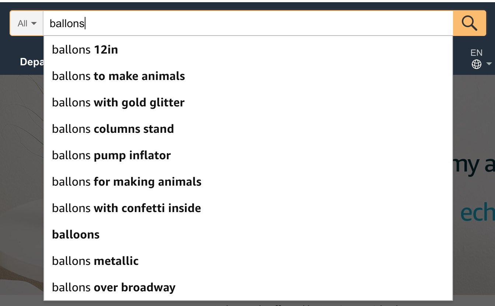
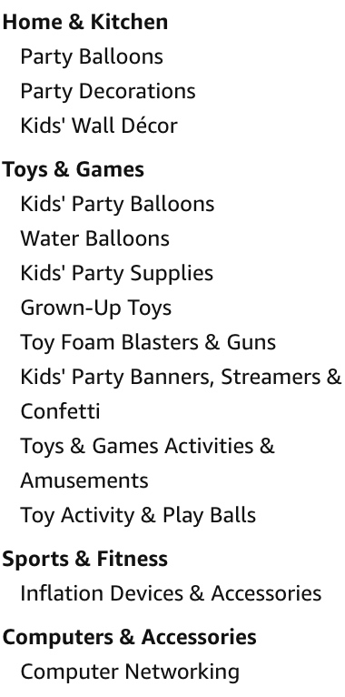
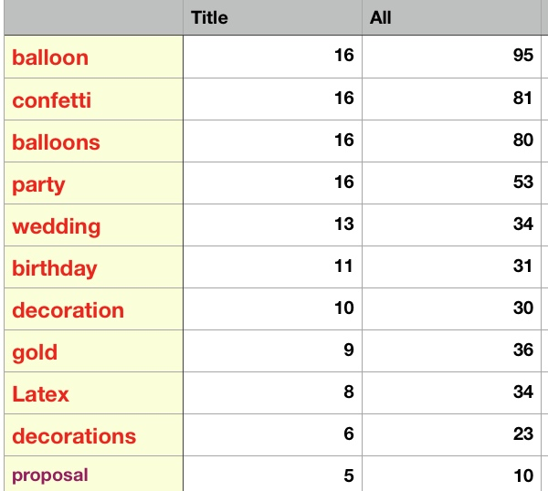

# confetti balloons-PRODUCT LISTING

## 搜索栏：

与confetti balloons相关的KEYWORD
- 12in
- gold glitter 金色闪光
- columns stand 柱形支架
- pump inflator 充气泵
- confetti inside 内含亮片
- metallic 金属的

## 左侧类目栏

与confetti balloons相关的KEYWORD
- **party balloons**
- party decorations
- kids wall decoration
- kids party balloons
- kids party supplies
- kids party banners, streamers & confetti

- baby shower girl
- balloons bulk
- balloons chrome 镀铬气球/金属气球
- balloons champagne
- balloons oval
- balloons metalled
- balloons large

## Title
*标题简明扼要，不能过长、不要堆砌关键字，服装<80字符，鞋包<50字符，其他品类<150字符*

标题公式：
品牌+核心关键词+亮点+其他关键词+次要卖点+材质+尺寸+用途+数量+颜色
AplusLife, Confetti Balloons, gold glitter/confetti inside, party balloons, gold balloons, confetti pre-filled, Transparent Latex, quality balloons, 12inch, party decorations wedding birthday proposal...20 pack, gold

- 金色亮片气球
**Gold Confetti Balloons, 12 Inches, 20 Pack Clear Latex Balloon With Confetti Pre-filled, for Party Decoration, Wedding, Birthday and Proposal**

- 玫瑰金亮片气球
**Rose Gold Confetti Balloons, 12 Inches, 20 Pack Clear Latex Balloon With Confetti Pre-filled, for Party Decoration Wedding, Birthday, Baby Shower**

 
- 金色混装气球
**Gold Confetti Balloon Set, 12 Inches, 40-pack Gold Latex Balloon and Pre-filled Confetti Ballon, Glitter Party Decoration for Wedding, Birthday, Proposal**

- 玫瑰金混装气球
**Rose Gold Confetti Balloon Set, 12 Inches, 40-pack Rose Gold Latex Balloon and Pre-filled Confetti Ballon, Glitter Party Decoration for 
Wedding, Birthday, Proposal**

- 五彩纸屑气球
【品牌AplusLife+核心关键词Confetti Balloons+亮点pre-filled+其他关键词Jumbo/Elephant/giant/large ballon+次要卖点Multicolor Confetti+材质quality latex+尺寸36inch+用途for wedding birthdays event+数量+颜色transparent clear】
**36 Inches Jumbo Confetti Balloons(5-Pack), Clear Latex Balloons with Multicolor Confetti Pre-filled, Party Decorations for Wedding, Birthday and Event.**

## 关于气球使用的Reviews
Beautiful balloons. Some tips....
I bought this by November, but I filled one with helium just a few days ago. It look awesome. I could be upset since the balloon had 2 small holes, but the girl who filled it out put some transparent tape and it worked just perfect. So we were good on that.
How much helium you will need: the balloons are 36" (3ft) or 90 cm fully inflated. You will need 15 cubic feet or 0.425 cubic meters. We used liquid glue to make the confetti stick to the balloon. YES, you have to filled the confetti by yourself (not really sure why so many complains with this), and YES is perfectly round, if you don't get the round shape is because you need more helium. I put tissue tassels, it look incredible with a much lower expense. I am happy with the purchase.

