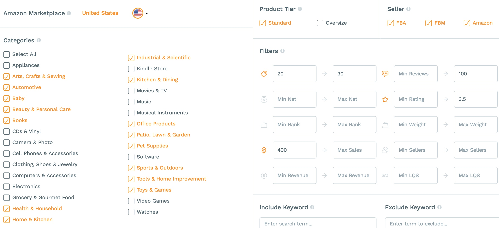
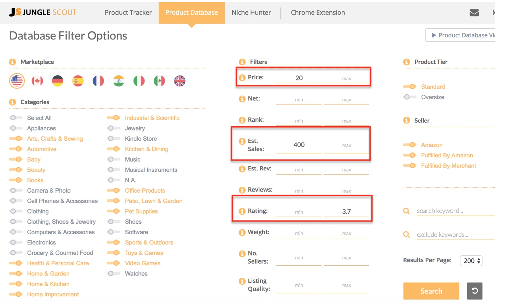
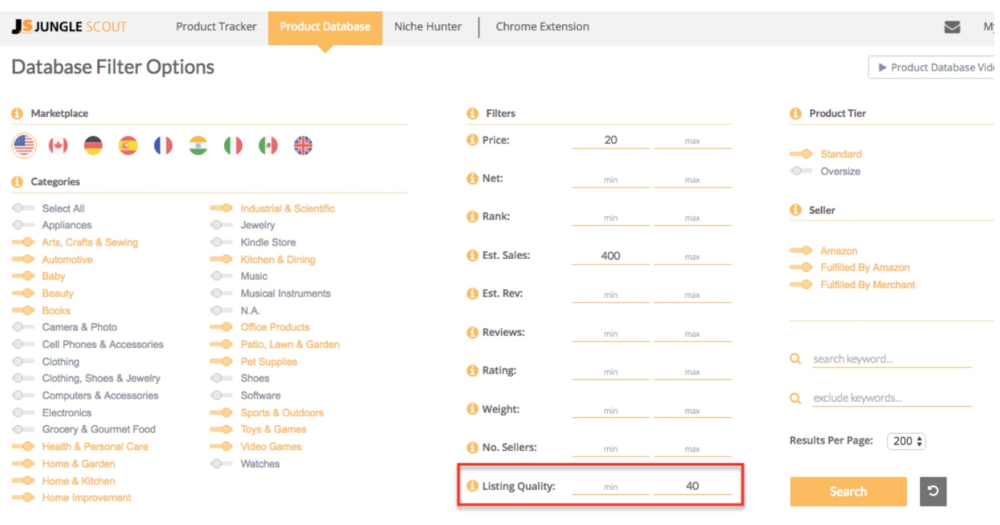
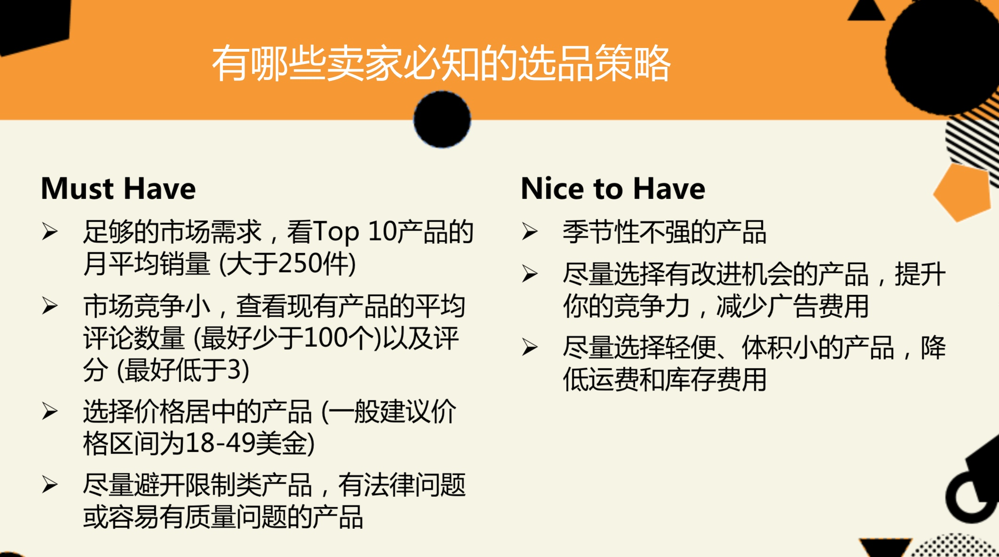

# 亚马逊选品灵感及思路

## 总体思路(方补充）
1. 利用“Product Database（产品数据库）”找到符合需求的畅销产品
2. 在搜索出的畅销产品中，筛选出“好的产品机会”
3. 进一步确认是否属于“好的产品机会”
4. 继续研究客户评价，并使用Jungle Scout的产品追踪器跟踪这些产品每天的实际销售数据

## 选品步骤
### 1.在“Product Database（产品数据库）”筛选出符合需求的畅销产品，搜索结果控制2000个以内

**Fliter**

过滤器设置标准:

- 价格 – 大于 $20 **【更容易获得理想收入】**
- 预测每月销量 – 每月销售大于400件产品，这样可以确保产品的畅销度。**【符合供应商最小进货量，避免库存积压】**
- 评论数量 – 少于100，因为评论数量少间接表明了产品上市时间较短，没有很长的客户评论历史，这意味着我们可以在短时间内与现有产品竞争。**【竞争低】**
- 评级 – 低于4.2，这样在亚马逊上会显示4星评论，也意味着产品有提升、改造的空间，可以进行市场差异化。**【改进产品获得竞争力】**
- 产品尺寸 – 标准，较小较轻的产品一方面运费会低，另一方面比较容易进行库存管理。**【成本低】**

### 2.在搜索结果中继续筛选：避开五类产品；符合三大特征
#### “好的产品机会”的基本标准：
- 稳定销量，季节性低
- 没有法律问题（避开许可证和商标的问题）
- 价格高于$18（才能有良好的利润）
- 产品有改进空间（评分低于4.2，显示4星的）
- 小巧、轻便

#### 避开这些产品：
- 避开了服装品牌和特许产品。
- 避开任何存在潜在安全隐患的产品
- 避免任何易碎或易坏的产品，包括玻璃或电子产品
- 水过滤器，因为可能有质量监控的问题
- 任何没有效果的东西，因为你可以避免差评（比如可以帮你减肥的塑料袋等）

#### 符合这些特征：
- 生产和质量监控相对简单
- 一些不常见的产品：那些产品往往是陌生的、概念模糊的且销售的卖家较少
- 容易找到合适的供应商（例如刀具可能就不容易找到优质的生产商）

### 3.进一步确认“好的产品机会”：
#### 搜索畅销产品的关键词，利用JS的chrome插件分析Rank前10的价格、销量、评价数
- 价格：大部分卖家的产品价格是否高于$18
- 需求：前10的总销量是否大于2000
- 需求：大部分/平均销量大于300
- 竞争：8家review低于100，或多家review低于50（这意味着有很大机会可以挤进前10）
- 利润：点击net，减去预估的产品成本，能否达到$10

#### 改进空间：查看现有产品评价，找到有价值的信息以分析这款产品是否有改进的空间（看看1星、2星客人如何评价产品）

#### 搜索情况、季节性趋势：在JS的chrome插件分析点击”Trend“查看关键词在Google Trends中的搜索趋势。如下所示：

## 其他选品方法
### 1.评级很差，却卖得不错

这款产品一定具有不错的市场需求，有足够量的消费者需要和购买这类产品，由于他们在市面上找不到其他合适的替代品，也只能买下这些产品，即便这些产品的评论并不高。

**通过阅读差评，你可以找到产品的弱点然后有针对性对产品进行改进。通过与生产商合作解决了现有产品的缺陷，并且作为卖点来进行市场营销。**

月销量大于400意味着每天可以卖出10-15件。评论小于3.7意味着产品在系统里显示为3.5颗星。因为如果评论值为3.8，在亚马逊上就会显示为4颗星，就是评价还不错的产品了。

### 2.上升很快的产品：listing不完善，评论也相对较少，但仍有可观的销量
LQS低于40分，但销量高：这意味着产品目前就有很高的市场需求，我们可以通过优化产品listing等方式获得不错的关键字排名，以及更高的销售额。

提升Listing质量：提供更加清晰的产品照片、介绍详细的产品标题、大量相关的关键字以及能够体现产品优势的产品描述。就可以说服更多的买家点击产品并购买，获得更高的收入和利润。

## 总体思路

1.通过下面的途径寻找相关关键词

2.记下关键词后移步到一下个环节：验证市场需求。通过以下几种方式来查看销量：

- 将关键词输入到Web App的Keyword Scout中，查看与其相关的关键词，以及关键词的搜索量，这些信息可以间接表明产品的需求
- 将关键词输入到亚马逊中，然后使用JS Pro插件来查看产品预测月销量以及机会分数 （机会分数>=7分为高分机会）
- 把亚马逊关键词搜索结果中预测销量不错的产品添加到Product Tracker中，以便跟踪产品的真实销量数据

3.优秀选品的参数

4.考虑成本保证利润率
5.通过review思考在选择供应商时需要考虑的因素和产品可改进的方向

## 灵感来源

### 亚马逊内部的排行榜

- [亚马逊热销榜-Amazon best seller](https://www.amazon.com/Best-Sellers/zgbs/)
- [亚马逊波动趋势-Amazon Movers & Shakers](https://www.amazon.com/gp/movers-and-shakers/)
- [亚马逊最新热点-Amazon New Releases](https://www.amazon.com/gp/new-releases/)
- [亚马逊愿望清单-Amazon Most Wished for](https://www.amazon.com/gp/most-wished-for/)
- [亚马逊礼物榜-Amazon Gift Ideas](https://zhuanlan.zhihu.com/p/30820916)

### 关键词趋势类

- [谷歌趋势-Google Trend](https://trends.google.com)
- [谷歌规划师-Google Adwords](https://adwords.google.com)
- [关键词工具-merchantwords](merchantwords.com/)

### 产品创意网站

- [TrendHunter](www.TrendHunter.com)

   这个网站有一点特别好，它可以给读者提供某一个品类在上一个月的创意，下图中可以看到的第一个标题叫“Top 25 Pet Trends in June”，点进去大家就可以看到在宠物品类中比较流行的一些产品创意。除了宠物品类，大家还可以看到手表、家居、电子产品、婴儿用户、科技和设计等等创意

### 论坛网站寻找产品创意
- [Snoopsnoo](Snoopsnoo.com)
- [reddit](https://www.reddit.com/)

### 通过社交媒体寻找产品创意

- Twitter
- Facebook
- Pinterest
- Instagram
- Snapchat

在这些平台上，大家可以通过搜索hashtag和trending topics来关注一些感兴趣的话题，和微博的标签及热搜相似。此外，大家还可以加入一些兴趣小组，关注一些社交红人来获得产品创意。

### 通过网站交易平台找产品创意

- [Flippa](https://flippa.com/)

点击进入这个网站后，你可以看到这个网站有哪些热销品，列在“Best Sellers”这里，有的时候是列在"Featured Products"下面。这里就是你寻找产品创意的好地方

### 通过众筹网站找到产品创意

- [Indiegogo](https://www.indiegogo.com/)
- [Kickstarter](https://www.kickstarter.com/)

## 参考文章

- [亚马逊站外搜索产品创意的6种方法，JS为你打开一扇新世界的大门](https://weibo.com/ttarticle/p/show?id=2309404271082713551861)
- [6种方法在亚马逊站外搜索产品创意，JS为你打开新世界的大门（下）](https://weibo.com/ttarticle/p/show?id=2309404273238225103005)
- [可能是史上最全的亚马逊选品工具](https://zhuanlan.zhihu.com/p/30820916)
- [百万美金案例研究：第1讲 – 寻找亚马逊产品创意](https://www.junglescout.cn/blog/how-to-find-amazon-product-ideas/)

