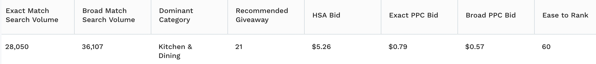
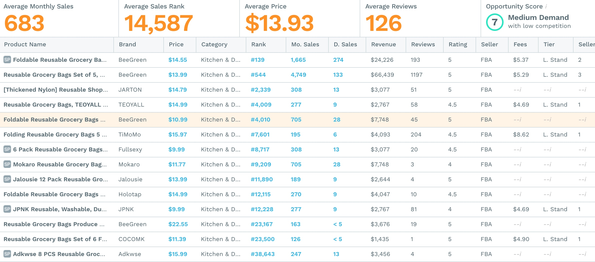

# reusable grocery bags/foldable grocery bags 折叠购物袋

## amazon's Listing
###BEEGREEN
#### size
*handles*:8.7inch(22.1cm) *width*:15inch(38.1cm) *high*:16inch(40.64cm) *flat*:6inch(15.24cm) *Volume*:50 lbs or 2-3 grocery 
#### 改进空间
- 还是会出现破洞
- 不耐用
- 提手容易分离
- 很难折回去
- 轻、感觉到明显的胶质
- 不能机洗
- 缝口位置容易裂开
- 跟描述的大小不对

### JARTON
#### size
*handles*:8inch(20.32cm) *width*:14inch(35.56cm) *high*:16inch(40.64cm) *flat*:3.5inch(8.89cm) *Volume*:35 lbs or  2 ~ 3 gallons of milk 
#### 改进空间

### HOLYLUCK
#### size
*handles*:8inch(20.32cm) *width*:25inch(63.5cm) *high*:16inch(40.64cm) *flat*:1.6inch(4.06cm) *Volume*:42 lbs
#### 改进空间
- 太薄
- 太小

### Holotap
#### size
*width*:14inch(35.56cm) *totalhigh*:23inch(58.42cm) *flat*:4inch(10.16cm) 
#### 改进空间
- 收藏袋质量不好
- 提手宽度太小

### TEOYALL
#### size
*width*:19.6inch(49.78cm) *height*:16.9inch(42.93cm) *flat*:3.1inch(7.87cm) 
#### 改进空间
- 材质太硬，易烂
- 提手宽度太小

## 初次询价模板
你好，我们是广州的亚马逊卖家。我们在找高质量“折叠购物袋”（大号）。需要先评估样品后下单。
以下是我们的产品需求：
·尺寸：（1）竖版大号：宽35cm高55cm侧边8cm，（2）横版大号：宽49cm高42cm侧边7.8cm
·材料：210D牛津布/涤纶190T
·质量：柔软、承重力好、不易破洞、提手的位置缝口不易分离

你们是否可以生产这种折叠购物袋？如果可以的话，麻烦提供以下信息：
1）产品规格和报价
2）产品多少个一组，包装是怎样的
3）样品费用，发到广州要多久
4）订单的制作和交付时间（是否有现货）

