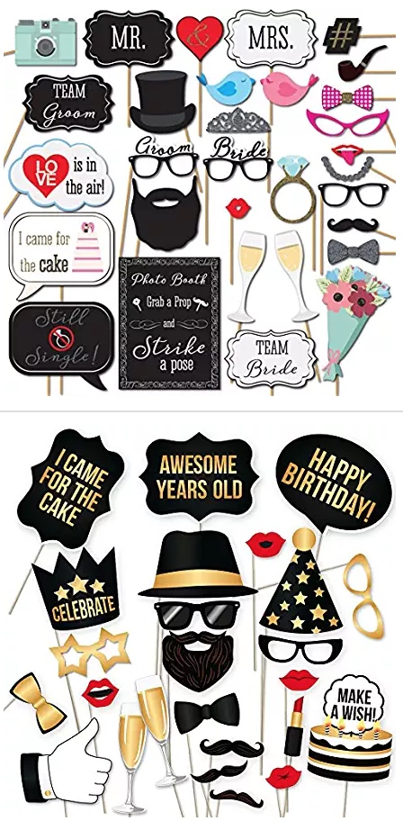

# 派对拍照道具
## 改进空间
- 胶粘不稳，需要额外的胶布（使用的点胶）
- 数量不够，个别数量差很多
- 尺寸太小（top1 rank）
- 包装太烂，被压弯，或沾了脏东西
- 缺少棍子

## 初次询价模板
你好，我们是广州的亚马逊卖家。我们准备采购派对拍照道具。需要先评估样品后下单，订购300套左右。
以下是我们的产品需求：
·尺寸：接近实物的尺寸（例如：眼镜、胡子、帽子等和实物大小接近）
·材料：白卡+棍子
·颜色：彩色（金色、黑色、红色为主）
·规格：35件套（或小于35件）
·质量：粘胶质量好，粘性大

你们是否可以生产这种派对用的拍照道具？如果可以的话，能否提供以下内容：
1）产品规格和报价，
2）用的是什么样的胶，是否需要DIY
2）产品的包装
3）样品多久可以拿到
4）订单的制作和交付时间（是否有现货）

