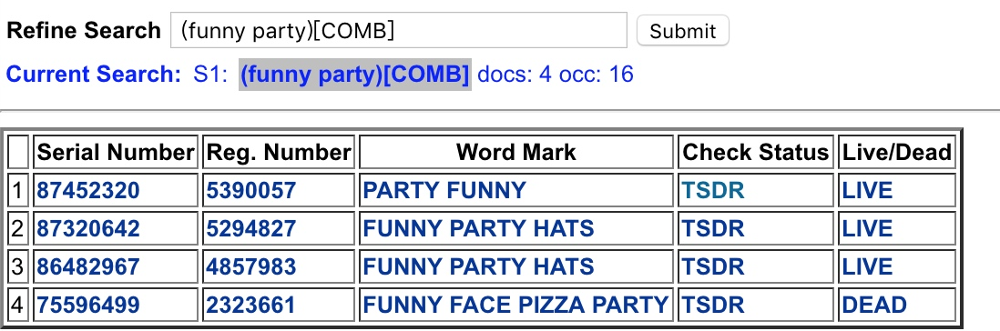
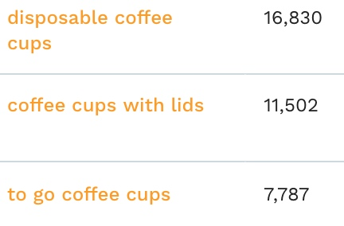
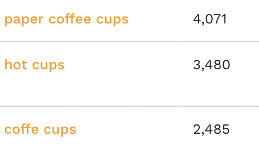
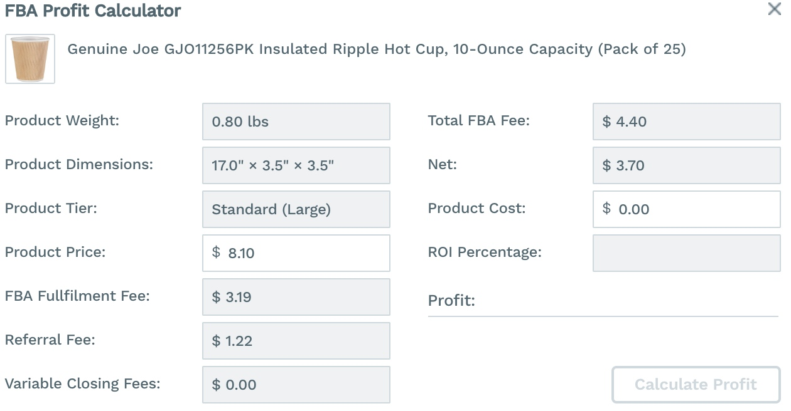
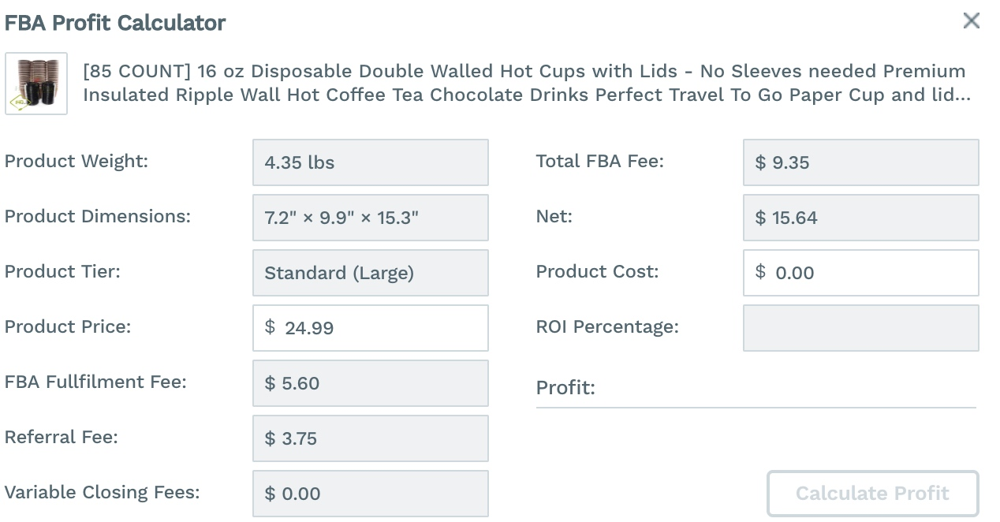
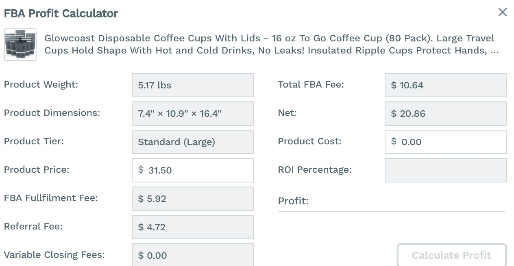
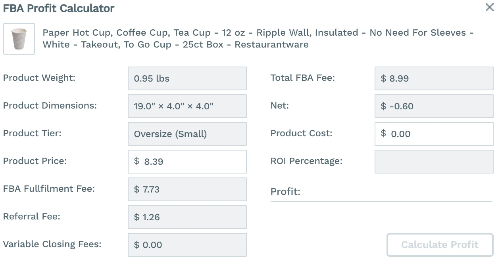
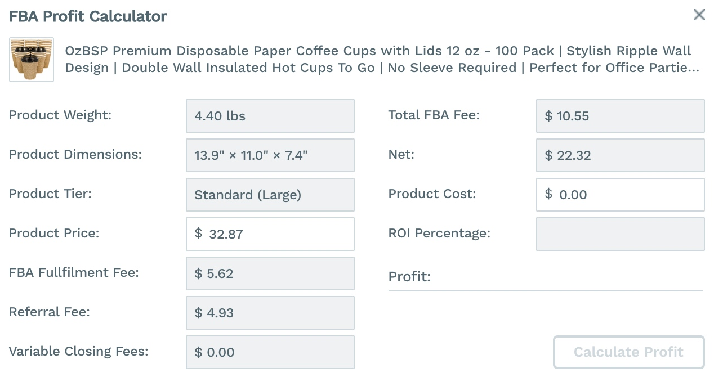

# Listing
如何写好listing：https://zhuanlan.zhihu.com/p/30814703

**确定品牌是否注册：http://www.uspto.gov/trademarks/index.jsp （美国商标局）**

- funny party

- 

## Coffee Cups
- category: Home & Kitchen > Kitchen & Dining > Food Service Equipment & Supplies > Disposables > Cups & Straws > Cups 

KEY WORDS:
Disposable
Coffee Cups With Libs
To Go 

Insulated
No Sleeves Needed

double-walled paper cups
Walled Paper Cups
Ripple Double Wall 
Slip Resistant

eco-friendly
slip-resistant
spill-resistant
non-slip grip

for Hot Coffee, Tea, or Chocolate Drinks

### Product Name： [100count]Apluslife 12oz Disposable Paper Coffee Cups With Libs - No Sleeves Needed - ToGo Travel 

### KEY WORDS(达成产品能够被搜索到的目的；补充完善标题不能覆盖的关键词，增加搜索和曝光的可能性)

#### 关键词的写法:
- 关键词字符数：每行1000个字符，共5行
- 输入多个单词作为搜索词时，请按最符合逻辑的顺序排列它们

## FBA费用估算
- 100pack的FBA费用估算（预计定价：$32.99）
**Large. Standard,14.8"*7.4"*7.4",3lbs**

FBA Fulfillment: 体积重6磅（5.8磅）4.71+0.38*4=6.23
Referall Fee: 32.99x0.15=4.95
FBA费用合计：6.23+4.95=11.18

- 50pack的FBA费用估算（预计定价：$18.99）
**Large. Standard,14.8"*7.4"*3.7",1.5lbs**

FBA Fulfillment: 体积重3磅（2.9磅）4.71+0.38*1=5.09
Referall Fee: 18.99x0.15=2.85
FBA费用合计：5.09+2.85=7.94

25-Pack,3.19+1.22=4.4
85-Pack,5.6+3.7=9.35
80-pack,5.92+4.72=0.64
50-Pack,4.8+2.7=7.5
25-Pack,7,73+1.26=8.99
100-Pack,5.62+4.93=10.55

